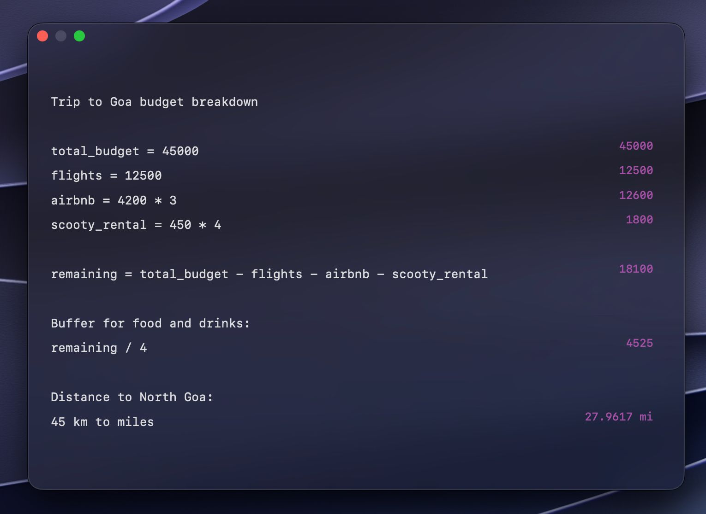
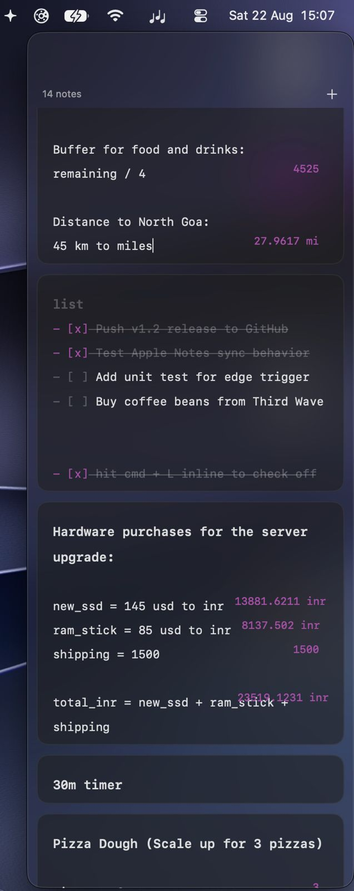
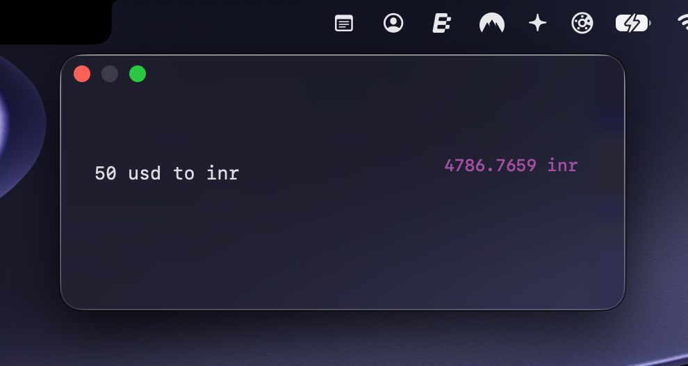
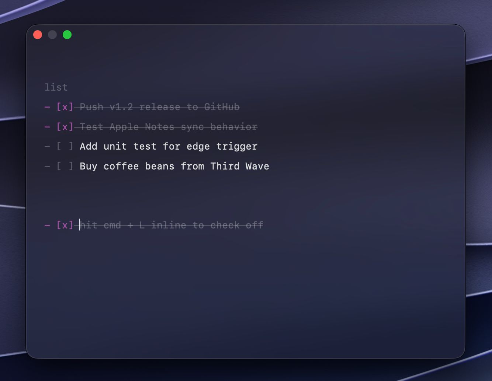
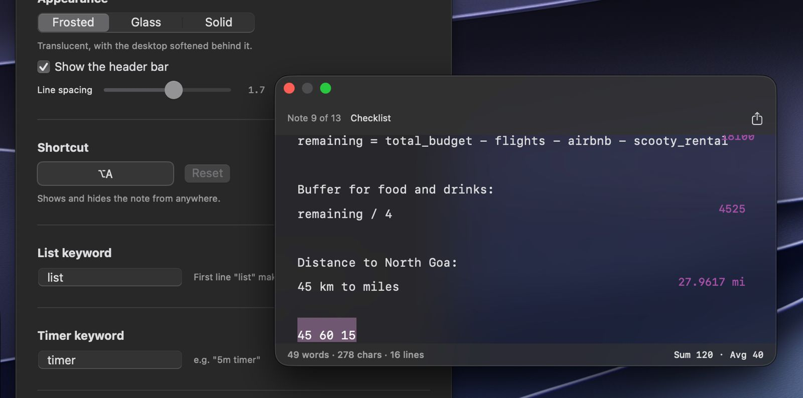
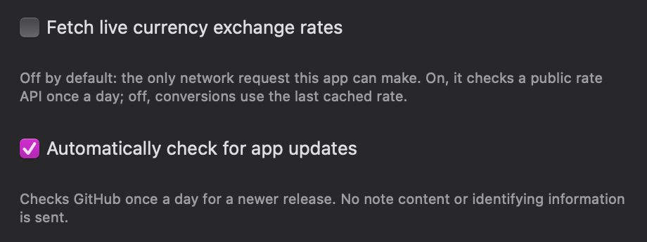

# Jot

A plain-text scratchpad for macOS. No Electron, no dependencies, no telemetry.


Option+A summons a note from anywhere. It floats, docks to the menu bar, sits
in a screen-edge sidebar, or lives in the Dock. Plain text, with checklists,
inline math, unit and currency conversion, images, and OCR, built on nothing
but Swift, AppKit, and SwiftUI. No Xcode project, no package manager, no
runtime dependency. The whole app is one `swiftc` invocation compiling
straight to a ~950KB binary with zero non-system libraries linked in.



## Install

```bash
brew install lsuryatej/jot/jot
```

Or, without Homebrew:

```bash
curl -fsSL https://raw.githubusercontent.com/lsuryatej/jot/main/install.sh | bash
```

Both install a prebuilt, checksum-verified `Jot.app` to `/Applications` (or
`~/Applications` if that's not writable) and never ask for `sudo`. Update with
`brew upgrade jot`, or from Jot's own menu bar icon → **Check for Updates**.

Jot is ad-hoc signed, not notarized. There's no paid Apple Developer account
behind this project. Both install paths strip the quarantine flag before you
ever open the app (`install.sh` directly, the Homebrew cask via a
`postflight` step), so neither should trigger a Gatekeeper "Not Opened"
dialog. If you see one anyway, most likely from a copy that predates one of
these fixes, right-click the app → Open, or go to System Settings → Privacy
& Security → **Open Anyway**.

**Removing a Homebrew-installed copy:** use `brew uninstall --cask jot`, not
`rm -rf`. Deleting the app directly leaves Homebrew's own install receipt
pointing at a copy that no longer exists, and the next `brew install` reports
"already installed" and does nothing.

### Continuous verification

Both install paths are checked by CI, not just by hand:

- **`smoke-test-install-sh`** runs on every release, as a second job in
  [`release.yml`](.github/workflows/release.yml), on its own fresh runner.
  Installs via `install.sh` against the release that job just published, then
  checks the app exists, is executable, matches the tagged version, carries a
  valid ad-hoc signature, and is not quarantined.
- **[`brew-smoke-test.yml`](.github/workflows/brew-smoke-test.yml)** runs
  daily, plus on demand, instead of per-release. The Homebrew cask is bumped
  by hand after each release, so there's always a window where it's briefly
  out of sync with the latest tag. Installs via the exact published
  `brew install lsuryatej/jot/jot` command on a throwaway runner, checks the
  same things, cleans up with `brew uninstall --cask jot`.

Both ran through a genuinely fresh machine before the quarantine fix was
trusted, not just the machine it was written on.

## Why this exists

Most "quick note" apps on macOS are either a $5-59 indie tool (Antinote,
Numi, Soulver) or a full Electron shell burning 150MB+ before you've typed a
word. Jot does the scratchpad basics, math that works, images you can drop
in, quick recall, in a binary smaller than most icon files.

## How it compares

Prices and feature lists as of August 2026, pulled from each app's own site
and App Store listing. All three are solid, well-made tools, this is just
what you get for free with Jot versus what they charge for.

| | **Jot** | [Antinote](https://antinote.io/) | [Numi](https://numi.app/) | [Soulver 4](https://soulver.app/) |
|---|---|---|---|---|
| Price | Free, open source | $5 one-time | Free, $23.59 to unlock notes + sync | $59 one-time (+$26/yr optional) |
| Inline math with variables | Yes | Yes | Yes | Yes |
| Unit conversion | Yes, offline | Yes | Yes | Yes |
| Currency conversion | Yes, opt-in live rates | Yes | Yes, paid tier | Yes, live by default |
| Checklists | Yes | Yes | No | No |
| Images pasted inline | Yes, resizable | No | No | No |
| Screenshot to text (OCR) | Yes, offline | Yes | No | No |
| Display modes | 5: floating, dock, menu bar, dropdown, screen edge | Menu bar only | Window | Window |
| Search across all notes | Yes | Yes | N/A | Yes |
| Sync across devices | No | iCloud (2.0+), iOS app in progress | iCloud, paid tier | iCloud, iOS/iPad apps |
| Scripting / themes | No | Yes, JS extensions + themes | No | CLI, URL schemes, Automator |
| Apple Notes sync | Yes, opt-in, one-way | No | No | No |
| Network requests | Zero by default, two opt-in toggles | iCloud only, if enabled | iCloud only, if paid | Live data on by default |
| Source | Open, MIT | Closed | Core open, paid features closed | Closed |

Jot doesn't beat any of these on every axis. Against Antinote specifically:
no sync across devices, no link shrink yet, no scripting or theming, no
AutoPaste. Antinote is also a mature, several-year-old product; Jot is new.
What Jot gives you instead is free and open source, inline resizable images,
five display modes instead of menu-bar-only, search across every note, and
an explicit zero-telemetry stance with both network-facing features off or
opt-in rather than bundled into iCloud.

## Features

**Global hotkey.** Option+A toggles the note from anywhere, rebindable in
Settings. Registered through Carbon's `RegisterEventHotKey`, which needs no
Accessibility permission and consumes the keystroke, so it won't also type
`å` into whatever app is in front.

**Five display modes**, switchable live in Settings:

| Mode | Behaviour |
|---|---|
| Floating | Always on top, no Dock icon, never steals focus. |
| Menu Bar | Ordinary window level, toggled from the menu bar icon. |
| Menu Bar Dropdown | Drops down under the icon, hides when you click away. |
| Dock | Dock icon and app switcher entry, like a normal app. |
| Screen Edge | A sidebar docked to a screen edge, holding every note as its own card, revealed by resting the cursor against that edge. |



**Inline math with variables.**

```
budget = 5000
budget * 1.2          → 6000
10 + 20%               → 12
5 km to miles          → 3.1069 mi
50 usd to inr           → 4385.96 inr
```

A recursive-descent parser evaluates the whole note top to bottom on every
keystroke. Variables assigned on one line are visible to every line below it.
A line with no operator is left as prose, even if it starts with a number, so
"5 apples" never turns into a calculation. Results are drawn in the right
margin and never touch the text itself.

**Unit and currency conversion.** Length, mass, time, data, and temperature
convert offline via a fixed table. Currency rates are fetched from a public,
key-free API, off by default (see Privacy below). When off, conversion uses
the last cached rate or a built-in snapshot.



**Checklists.** Type `list` alone on the first line and the whole note
becomes a checklist. Every line below it turns into an item, and Return keeps
making more. Click a checkbox to toggle it, Cmd+L toggles the current line or
a whole selection, Tab/Shift-Tab nest items, completed items dim and strike
through. The file on disk stays plain markdown (`- [ ]` / `- [x]`), so it
renders as a real task list in Obsidian, Bear, or GitHub.



**Images.** Paste or drop an image and it stays an image, drawn inline,
resizable by dragging its edge. It's written to `Attachments/` beside your
notes, referenced from the text as ``, so a
note with a picture in it is still something you can read in `cat`.

**Screenshot to text.** Shift-Cmd-V reads the image on your clipboard with
Apple's Vision framework and inserts the text it finds. Fully offline, on the
Neural Engine, no cloud OCR service involved.

**Search, counts, and totals.** Cmd+F opens the real macOS find bar with
match highlighting. Cmd+Shift+F searches every note at once instead of just
the open one, jumping straight to the matching line. A footer shows live
word/character/line counts, and selecting text with two or more numbers in
it shows their sum and average. Select `rent $1,240.50 and food $310.25` and
see the total without leaving the note.

**Timers.** `5m timer`, `30s timer`, `2h timer`, the keyword is configurable.
A timer belongs to the note that started it and won't restart itself after
firing.

**Optional Apple Notes sync.** Off by default. Turn it on and each note is
pushed into a "Jot" folder in Apple Notes, one direction only. Nothing
written there is ever read back, and deleting a note in Jot never deletes it
in Notes. Images sync too, embedded as real inline images, not just their
markdown reference.

**Appearance.** Frosted, Glass, or Solid surfaces, header and footer can be
hidden entirely, line spacing is adjustable, down to nothing but text on
glass if that's what you want.



## Shortcuts

| Shortcut | Action |
|---|---|
| **Option+A** (configurable) | Show or hide Jot from anywhere on macOS |
| **Cmd+N** | New note |
| **Cmd+W** | Close the frontmost window, hides the note or closes Settings |
| **Cmd+L** | Toggle the checkbox on the current line, or every line selected |
| **Shift+Cmd+V** | Read the clipboard image as text (OCR) instead of pasting it |
| **Cmd+F** | Find in the current note |
| **Shift+Cmd+F** | Search every note, jump straight to the match |
| **Cmd+G** / **Shift+Cmd+G** | Find next / find previous |
| **Cmd+E** | Use the current selection as the find term |
| **Cmd+,** | Settings |
| **Cmd+Q** | Quit |
| **Tab** / **Shift+Tab** | Nest or un-nest a checklist item |
| Two-finger swipe | Move between notes (single-note display modes) |
| Drag an image's edge | Resize it in place |

Cut/Copy/Paste/Select All/Undo/Redo are the standard Cmd+X/C/V/A/Z/Shift+Cmd+Z
you'd expect anywhere on macOS.

## Privacy

Jot makes **zero network requests by default.** The only two things that can
ever leave your machine, both opt-in and both toggleable in Settings:

- **Live currency rates**, off by default. On, it's one request a day to a
  public, key-free exchange-rate API. Nothing about you or your notes is in
  the request.
- **Update checks**, on by default. A stale copy silently missing bug fixes
  is a worse outcome than one anonymous GET a day to GitHub's public releases
  API. Turn it off in Settings if you'd rather not.

Nothing else. No analytics, no crash reporting, no identifiers. Apple Notes
sync, when you turn it on, talks to Notes.app locally via AppleScript. It
never touches the network.



## Building from source

```bash
git clone https://github.com/lsuryatej/jot.git
cd jot
./build.sh && open Jot.app
```

```bash
./test.sh   # logic tests, no Xcode project, no simulator, just swiftc
```

**Xcode is required**, not just the Command Line Tools. The macOS 27 beta CLT
ships a `swiftc` that can't read its own SDK. Xcode bundles a matched
toolchain and SDK pair, so `build.sh` locates one explicitly (checking
`/Applications/Xcode-beta.app`, then `/Applications/Xcode.app`) instead of
trusting `xcode-select`. On a non-beta macOS this constraint likely doesn't
apply at all, a normal Xcode install should just work.

## Layout

| Path | Role |
|---|---|
| `src/main.swift` | AppKit entry point |
| `src/Jot.swift` | App delegate, display modes, panel, status item |
| `src/MainMenu.swift` | Menu bar, including the Find items that drive Cmd+F |
| `src/SettingsManager.swift` | Preferences, display-mode and privacy-toggle definitions |
| `src/PreferencesView.swift` | Settings window and the shortcut recorder |
| `src/HotKeyController.swift` | Global shortcut registration |
| `src/KeyCombo.swift` | Shortcut model and its display form |
| `src/MathExpression.swift` | The math parser and evaluator |
| `src/Units.swift` | Unit conversion tables |
| `src/CurrencyRates.swift` | Opt-in live exchange rates, cached |
| `src/UpdateChecker.swift` | Opt-out GitHub release check |
| `src/TextStatistics.swift` | Word counts and selection sum/average |
| `src/Checklist.swift` | Checklist parsing, rewriting, and list mode |
| `src/EdgeTrigger.swift` | Screen-edge trigger strip and hot side |
| `src/EdgeStackView.swift` | The edge sidebar and its note cards |
| `src/Note.swift` | The note model and its stable identity |
| `src/GlobalSearch.swift` | Cross-note search, matching every note's text directly |
| `src/GlobalSearchView.swift` | The Cmd+Shift+F overlay |
| `src/Attachments.swift` | Inline image storage and markdown references |
| `src/TextRecognition.swift` | Vision-backed screenshot to text |
| `src/AppleNotesSync.swift` | One-way push into Apple Notes |
| `src/ContentView.swift` | Panel UI: header, editor, timer overlay, share |
| `src/PlainTextEditor.swift` | `NSTextView` wrapper: swipe, images, math rendering |
| `src/NotesManager.swift` | Note state, navigation, timer parsing |
| `src/NoteStore.swift` | Atomic file persistence, backups, and migrations |
| `tests/` | Logic tests, run by `./test.sh` |
| `resources/Info.plist` | Bundle metadata |
| `resources/AppIcon.icns` | App icon, regenerated by `scripts/make-icon.swift` |
| `scripts/release.sh` | Builds and packages a release zip |
| `install.sh` | The curl-installable install path |

`NotesManager`, `NoteStore`, `MathExpression`, `Checklist`, `GlobalSearch`,
and `Attachments` are deliberately free of SwiftUI and AppKit, so every rule
in them is covered by a dependency-free test. `./test.sh` runs 229 checks
total, that plus a UI-layer slice against real `NSTextView` instances, in a
few seconds.

`Jot.app/` and `dist/` are build output and gitignored. `build.sh` deletes
and rebuilds the bundle every run, so a stale binary or signature can't
survive.

## Data

Notes live at `~/Library/Application Support/Jot/notes.json`, written
atomically and debounced, with ten rotating dated backups kept in `Backups/`
alongside it. Images live in `Attachments/`. Settings are in `UserDefaults`
under `com.suryatejlalam.Jot`.

## Not done yet

- No URL shortening/elision for long links yet.
- Notes can't be reordered.
- No sync across devices.
- Apple Notes sync is one-way, nothing written there is read back.
- The build targets `arm64` only.

## License

[MIT](LICENSE)
