# Jot

A plain-text scratchpad for macOS. No Electron, no dependencies, no telemetry.


Option+A summons a note from anywhere. It floats, docks to the menu bar, sits
in a screen-edge sidebar, or lives in the Dock. Plain text, with checklists,
ordered lists, themes, inline math, unit and currency conversion, images,
and OCR, built on nothing but Swift, AppKit, and SwiftUI. No Xcode project,
no package manager, no runtime dependency. The whole app is one `swiftc`
invocation compiling straight to a ~950KB binary with zero non-system
libraries linked in.

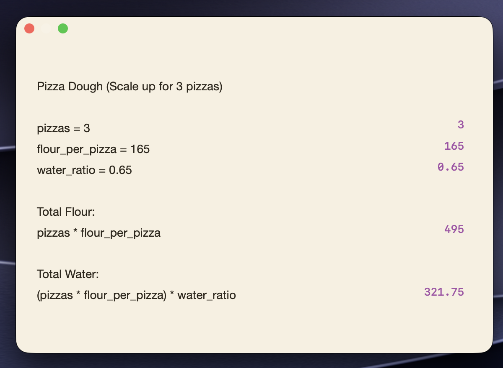

## Install

```bash
brew install lsuryatej/jot/jot
```

Or, without Homebrew:

```bash
curl -fsSL https://raw.githubusercontent.com/lsuryatej/jot/main/install.sh | bash
```

Both install a prebuilt, checksum-verified `Jot.app` to `/Applications` (or
`~/Applications` if that's not writable) and never ask for `sudo`. Update with
`brew upgrade jot`, or from Jot's own menu bar icon → **Check for Updates**.

Jot is ad-hoc signed, not notarized. There's no paid Apple Developer account
behind this project. Both install paths strip the quarantine flag before you
ever open the app (`install.sh` directly, the Homebrew cask via a
`postflight` step), so neither should trigger a Gatekeeper "Not Opened"
dialog. If you see one anyway, most likely from a copy that predates one of
these fixes, right-click the app → Open, or go to System Settings → Privacy
& Security → **Open Anyway**.

**Removing a Homebrew-installed copy:** use `brew uninstall --cask jot`, not
`rm -rf`. Deleting the app directly leaves Homebrew's own install receipt
pointing at a copy that no longer exists, and the next `brew install` reports
"already installed" and does nothing.

### Continuous verification

Both install paths are checked by CI, not just by hand:

- **`smoke-test-install-sh`** runs on every release, as a second job in
  [`release.yml`](.github/workflows/release.yml), on its own fresh runner.
  Installs via `install.sh` against the release that job just published, then
  checks the app exists, is executable, matches the tagged version, carries a
  valid ad-hoc signature, and is not quarantined.
- **[`brew-smoke-test.yml`](.github/workflows/brew-smoke-test.yml)** runs
  daily, plus on demand, instead of per-release. The Homebrew cask is bumped
  by hand after each release, so there's always a window where it's briefly
  out of sync with the latest tag. Installs via the exact published
  `brew install lsuryatej/jot/jot` command on a throwaway runner, checks the
  same things, cleans up with `brew uninstall --cask jot`.

Both ran through a genuinely fresh machine before the quarantine fix was
trusted, not just the machine it was written on.

## Why this exists

Most "quick note" apps on macOS are either a $5-59 indie tool (Antinote,
Numi, Soulver) or a full Electron shell burning 150MB+ before you've typed a
word. Jot does the scratchpad basics, math that works, images you can drop
in, quick recall, in a binary smaller than most icon files.

## How it compares

Prices and feature lists as of August 2026, pulled from each app's own site
and App Store listing. All three are solid, well-made tools, this is just
what you get for free with Jot versus what they charge for.

| | **Jot** | [Antinote](https://antinote.io/) | [Numi](https://numi.app/) | [Soulver 4](https://soulver.app/) |
|---|---|---|---|---|
| Price | Free, open source | $5 one-time | Free, $23.59 to unlock notes + sync | $59 one-time (+$26/yr optional) |
| Inline math with variables | Yes | Yes | Yes | Yes |
| Unit conversion | Yes, offline | Yes | Yes | Yes |
| Currency conversion | Yes, opt-in live rates | Yes | Yes, paid tier | Yes, live by default |
| Checklists | Yes | Yes | No | No |
| Images pasted inline | Yes, resizing WIP | No | No | No |
| Screenshot to text (OCR) | Yes, offline | Yes | No | No |
| Display modes | 5: floating, dock, menu bar, dropdown, screen edge | Menu bar only | Window | Window |
| Search across all notes | Yes | Yes | N/A | Yes |
| Long links collapse to their domain | Yes | Yes | N/A | N/A |
| Sync across devices | No | iCloud (2.0+), iOS app in progress | iCloud, paid tier | iCloud, iOS/iPad apps |
| Scripting / themes | Themes (notes); no scripting | Yes, JS extensions + themes | No | CLI, URL schemes, Automator |
| Apple Notes sync | Yes, opt-in, one-way | No | No | No |
| Network requests | Zero by default, two opt-in toggles | iCloud only, if enabled | iCloud only, if paid | Live data on by default |
| Source | Open, MIT | Closed | Core open, paid features closed | Closed |

Jot doesn't beat any of these on every axis. Against Antinote specifically:
no sync across devices, no scripting or theming, no AutoPaste. Antinote is
also a mature, several-year-old product; Jot is new. What Jot gives you
instead is free and open source, inline images, five display modes
instead of menu-bar-only, search across every note, link shrink, and
an explicit zero-telemetry stance with both network-facing features off or
opt-in rather than bundled into iCloud.

## Features

**Global hotkey.** Option+A toggles the note from anywhere, rebindable in
Settings. Registered through Carbon's `RegisterEventHotKey`, which needs no
Accessibility permission and consumes the keystroke, so it won't also type
`å` into whatever app is in front.

**Five display modes**, switchable live in Settings:

| Mode | Behaviour |
|---|---|
| Floating | Always on top, no Dock icon, never steals focus. |
| Menu Bar | Ordinary window level, toggled from the menu bar icon. |
| Menu Bar Dropdown | Drops down under the icon, hides when you click away. |
| Dock | Dock icon and app switcher entry, like a normal app. |
| Screen Edge | A sidebar docked to a screen edge, holding every note as its own card, revealed by resting the cursor against that edge. |

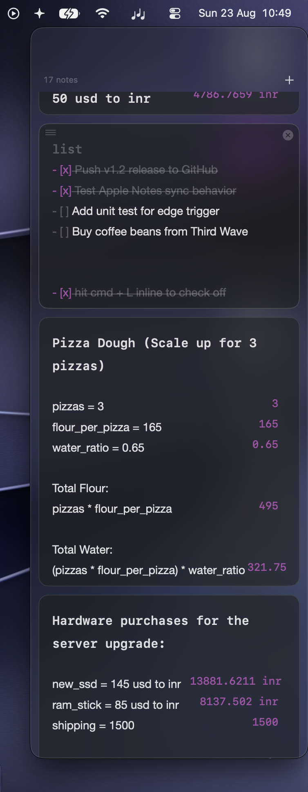

**Inline math with variables.**

```
budget = 5000
budget * 1.2          → 6000
10 + 20%               → 12
5 km to miles          → 3.1069 mi
50 usd to inr           → 4385.96 inr
```

A recursive-descent parser evaluates the whole note top to bottom on every
keystroke. Variables assigned on one line are visible to every line below it.
A line with no operator is left as prose, even if it starts with a number, so
"5 apples" never turns into a calculation. Results are drawn in the right
margin and never touch the text itself.

**Unit and currency conversion.** Length, mass, time, data, and temperature
convert offline via a fixed table. Currency rates are fetched from a public,
key-free API, off by default (see Privacy below). When off, conversion uses
the last cached rate or a built-in snapshot.

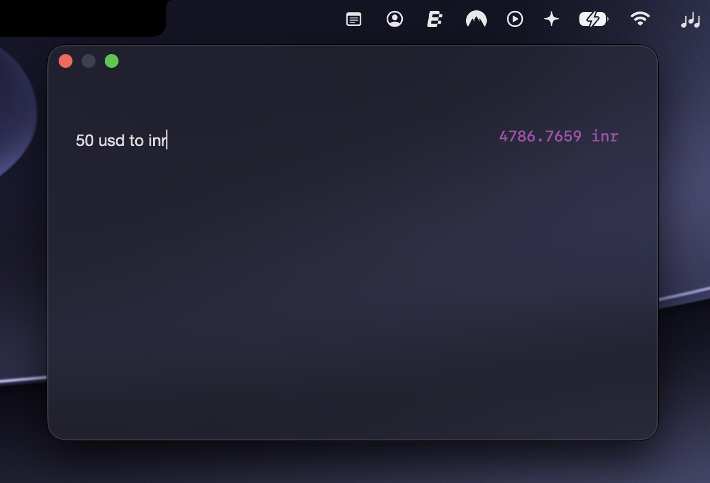

**Checklists.** Type `list` alone on the first line and the whole note
becomes a checklist. Every line below it turns into an item, and Return keeps
making more. Pasting multi-line text splits it into items, one per line.
Click a checkbox to toggle it, Cmd+L toggles the current line or a whole
selection, Tab/Shift-Tab nest items, completed items dim and strike through.
The file on disk stays plain markdown (`- [ ]` / `- [x]`), so it renders as a
real task list in Obsidian, Bear, or GitHub.

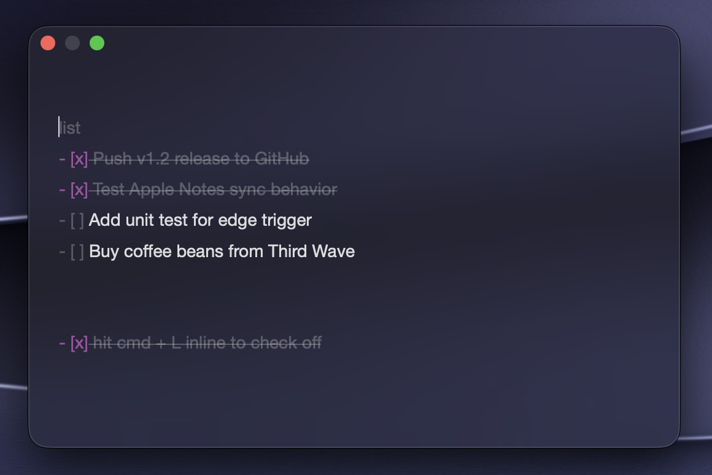

**Code blocks.** Type `code` alone on the first line and the whole note
renders as monospaced code. Everything this app normally reads out of your
text stays switched off inside it: no checklists, no headings, no
highlights, no shrunk links, no math results. `==` is an operator again and
`# ` is a comment. The keyword is configurable in Settings, like `list`.
Cmd+C with nothing selected copies the whole block, keyword line excluded,
so you can put the caret anywhere in it and paste the code straight out.

**Ordered lists.** Type `1.` or `a.` or `iv.` at the start of a line,
anywhere in any note, and it's a list item. Return continues it — `2.`, then
`3.`, or `b.`, or `iii.` — case preserved, and Return on an empty item ends
the list instead of stacking markers. Markers render bold beside their text.
The file keeps exactly what you typed; nothing is renumbered behind your
back.

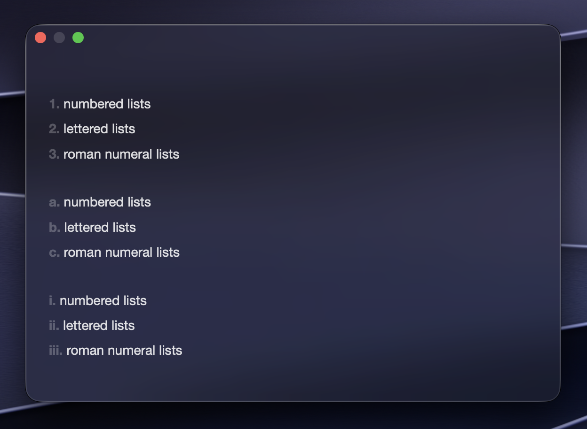

**Themes.** Type `theme` alone on a note's first line and that note becomes
a theme for the whole app, live as you type:

```
theme
paper: #223038
ink: #e8e4d8
size: 14
guides: dots
```

One `key: value` pair per line; anything unrecognised is ignored rather than
rejected, so prose can sit among the settings as commentary. Give the paper
a hex and the rest of the palette derives from it, or use a translucent
surface with a named tint (`tint: amber`). The theme exists only while its
note does: edit it like any other text, delete it and the app falls back to
your Settings. Nothing separate is saved anywhere.

**Headings.** Start a line with `#`, `##`, or `###` and it renders as one,
sized by its level. Same trade as the checklists: the hashes stay in the
file, so a note with headings is still plain markdown everywhere else. A
heading's hashes are folded out of view on screen, and when the first line
is a heading, its text becomes the note's title instead of getting a
one-size-fits-all title treatment.

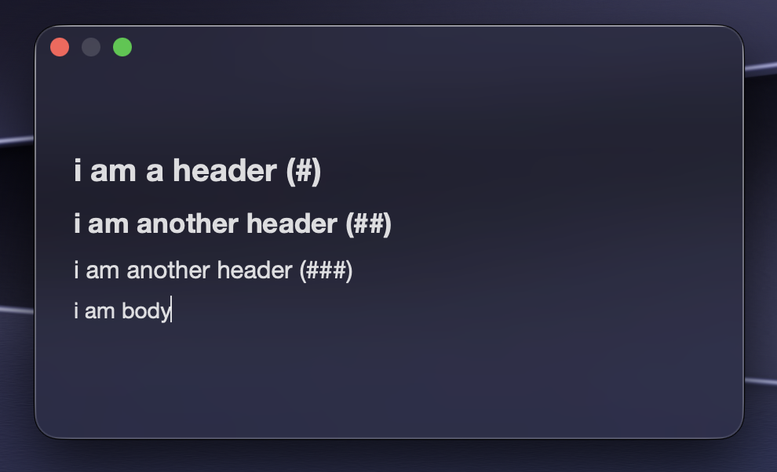

**Highlighting.** Select text and hit Shift-Cmd-H (or the Highlight button)
to wrap it in `==like this==` — Obsidian's own highlighter syntax, so it
still renders as a real highlight wherever else the note ends up. The `==`
markers fold out of view the same way heading hashes do, leaving just the
painted text behind; hit Shift-Cmd-H again on the highlighted text to strip
them back off. With nothing selected it drops an empty pair and puts the
caret between them, ready to type straight into a new highlight.

**Images.** Paste or drop an image and it stays an image, drawn inline. It's
written to `Attachments/` beside your notes, referenced from the text as
``, so a note with a picture in it is still
something you can read in `cat`. Drag-to-resize exists but is unreliable
right now and being worked on, see [BACKLOG.md](BACKLOG.md).

**Screenshot to text.** Shift-Cmd-V reads the image on your clipboard with
Apple's Vision framework and inserts the text it finds. Fully offline, on the
Neural Engine, no cloud OCR service involved.

**Link shrink.** A long URL collapses to just its domain, `example.com`
instead of the full `https://www.example.com/some/very/long/path?query=1`.
Cmd-click the domain to expand it back to the full link, Cmd-click again to
collapse it. The file on disk always has the whole URL; only the display
folds it away, so exporting or reading the note in `cat` shows every
character you typed.

**Search, counts, and totals.** Cmd+F opens the real macOS find bar with
match highlighting. Cmd+Shift+F searches every note at once instead of just
the open one, jumping straight to the matching line. A footer shows live
word/character/line counts, and selecting text with two or more numbers in
it shows their sum and average. Select `rent $1,240.50 and food $310.25` and
see the total without leaving the note.

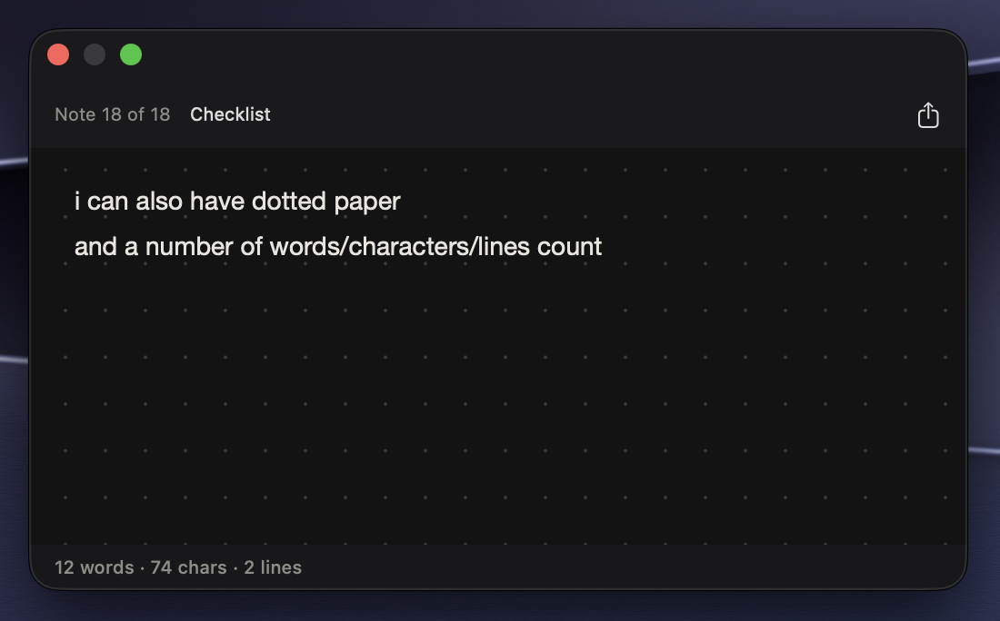

**Reorder notes.** Hover a card in the Screen Edge sidebar and drag it by the
grip in its corner; the stack parts around the drag and the order you leave
it in is the saved order. Away from the edge, Ctrl-Cmd-Up and Ctrl-Cmd-Down
walk the open note through the list one slot at a time. Either way you stay
on the note you were reading.

**Switch notes from the keyboard.** Cmd-Option-Right and Cmd-Option-Left move
to the next or previous note, the keyboard equivalent of a two-finger swipe —
same Safari/Chrome muscle memory as switching tabs.

**Timers.** `5m timer`, `30s timer`, `2h timer`, the keyword is configurable.
A timer belongs to the note that started it and won't restart itself after
firing. When one fires you get a proper sound and, if you want it, confetti:
cannons from the bottom corners, rain from above, or a single burst, your
pick in Settings. The celebration never takes focus from what you're typing.

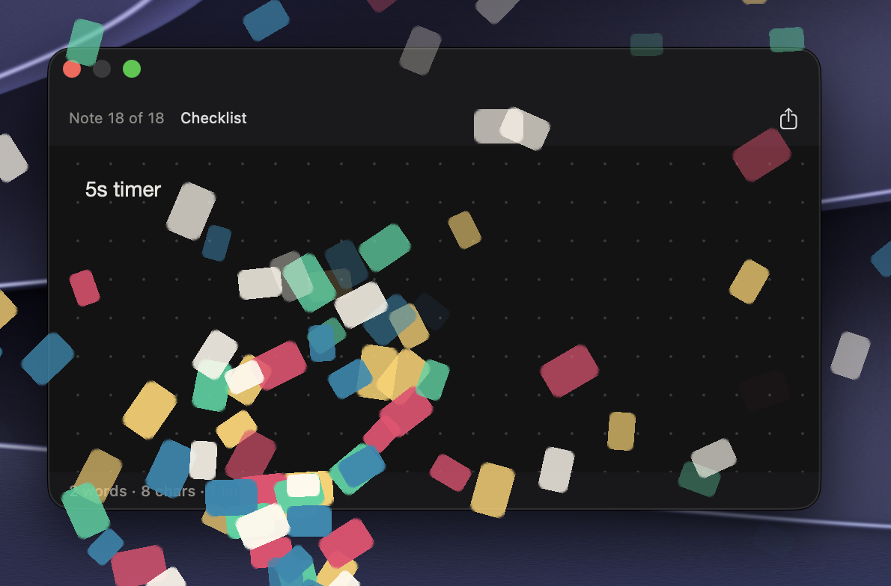

**Pomodoro.** `pomodoro 25/5` starts a work/break cycle — work minutes, then
break minutes, either side of the slash, keyword configurable separately from
the plain timer's. The overlay chip labels which half you're in ("Work" in
red, "Break" in green) and each phase fires the same timer celebration as a
plain timer before starting the next one automatically; it keeps alternating
for as long as the directive stays in the note.

**Optional Apple Notes sync.** Off by default. Turn it on and each note is
pushed into a "Jot" folder in Apple Notes, one direction only. Nothing
written there is ever read back, and deleting a note in Jot never deletes it
in Notes. Image sync is still being worked on — a picture in a note
currently arrives in Notes as a separate file attachment rather than
appearing inline, see [BACKLOG.md](BACKLOG.md).

**Typography, per note.** Eight curated system fonts, SF Mono through American
Typewriter, plus a size slider — set independently for whichever note you have
open, so switching one note to a serif for reading doesn't drag every other
note along with it. Reachable two ways: a compact font-name menu and size
stepper right in the header (hidden along with the rest of the header, Cmd+/),
or the fuller Typography section in Settings, both edit the same per-note
choice. Settings shows a separate, smaller "Default for new notes" pair that
only new notes pick up; Reset next to the per-note controls goes back to it.
Letter-spacing and line-spacing stay app-wide, beside the existing controls.
Curated rather than the system Font Panel on purpose: every note-type feature
here repaints font attributes across the whole note on every keystroke, so a
per-character font pick from the full Font Book would only ever look like it
worked before vanishing on the next edit — the standard "Font ▸ Show Fonts…"
context-menu item is switched off for exactly that reason.

**Paper types.** Six surfaces: Frosted, Glass, Solid, True Dark, Cream, and
White. The translucent ones take an optional colour tint (graphite, amber,
rose, moss, indigo), previewed on their picker entries; the opaque papers
bring their own ink colors rather than following the system's light or dark
mode, so True Dark stays readable in daylight. Optional writing guides
underneath the text, dot grid or square grid, drawn to follow your font and
line spacing. Header and footer can still be hidden entirely, down to
nothing but text on paper.

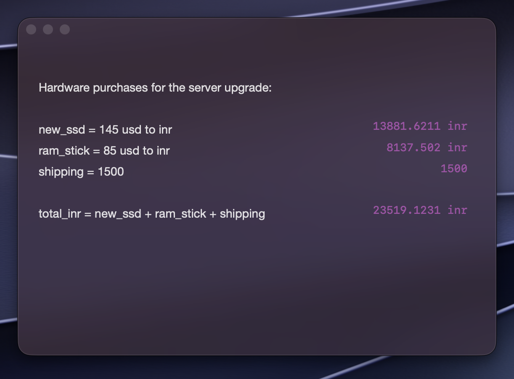

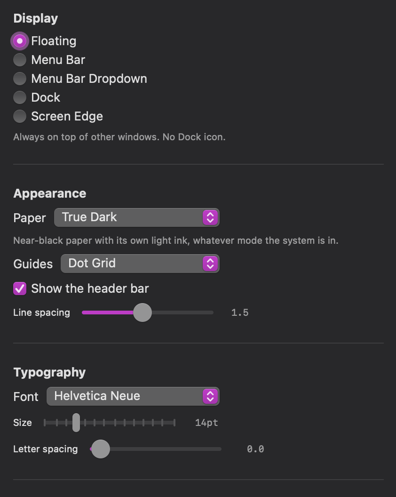

*(Screenshot predates the sidebar redesign below — Settings now splits into
General/Appearance/Typography/Notes & Timers/Privacy & Sync panes rather than
one long scroll.)*

## Shortcuts

| Shortcut | Action |
|---|---|
| **Option+A** (configurable) | Show or hide Jot from anywhere on macOS |
| **Cmd+N** | New note |
| **Cmd+W** | Close the frontmost window, hides the note or closes Settings |
| **Cmd+L** | Toggle the checkbox on the current line, or every line selected |
| **Cmd+C** (nothing selected, in a `code` note) | Copy the whole code block |
| **Shift+Cmd+H** | Highlight the selection (`==like this==`), or start one at the caret |
| **Cmd+/** | Toggle the header and footer together |
| **Shift+Cmd+V** | Read the clipboard image as text (OCR) instead of pasting it |
| **Cmd+F** | Find in the current note |
| **Shift+Cmd+F** | Search every note, jump straight to the match |
| **Cmd+G** / **Shift+Cmd+G** | Find next / find previous |
| **Cmd+E** | Use the current selection as the find term |
| **Cmd+,** | Settings |
| **Cmd+Q** | Quit |
| **Tab** / **Shift+Tab** | Nest or un-nest a checklist item |
| **Cmd+Option+→** / **Cmd+Option+←** | Switch to the next or previous note |
| **Ctrl+Cmd+↑** / **Ctrl+Cmd+↓** | Move the current note up or down the list |
| Drag a card's grip (hover, Screen Edge mode) | Reorder notes in the sidebar |
| Two-finger swipe | Move between notes (single-note display modes); with the header hidden, a brief badge names the note you landed on |
| Drag an image's edge | Resize it in place (currently unreliable, see [BACKLOG.md](BACKLOG.md)) |
| Cmd-click a shrunk link | Expand it to the full URL, click again to collapse |

Cut/Copy/Paste/Select All/Undo/Redo are the standard Cmd+X/C/V/A/Z/Shift+Cmd+Z
you'd expect anywhere on macOS.

## Privacy

Jot makes **zero network requests by default.** The only two things that can
ever leave your machine, both opt-in and both toggleable in Settings:

- **Live currency rates**, off by default. On, it's one request a day to a
  public, key-free exchange-rate API. Nothing about you or your notes is in
  the request.
- **Update checks**, on by default. A stale copy silently missing bug fixes
  is a worse outcome than one anonymous GET a day to GitHub's public releases
  API. Turn it off in Settings if you'd rather not.

Nothing else. No analytics, no crash reporting, no identifiers. Apple Notes
sync, when you turn it on, talks to Notes.app locally via AppleScript. It
never touches the network.

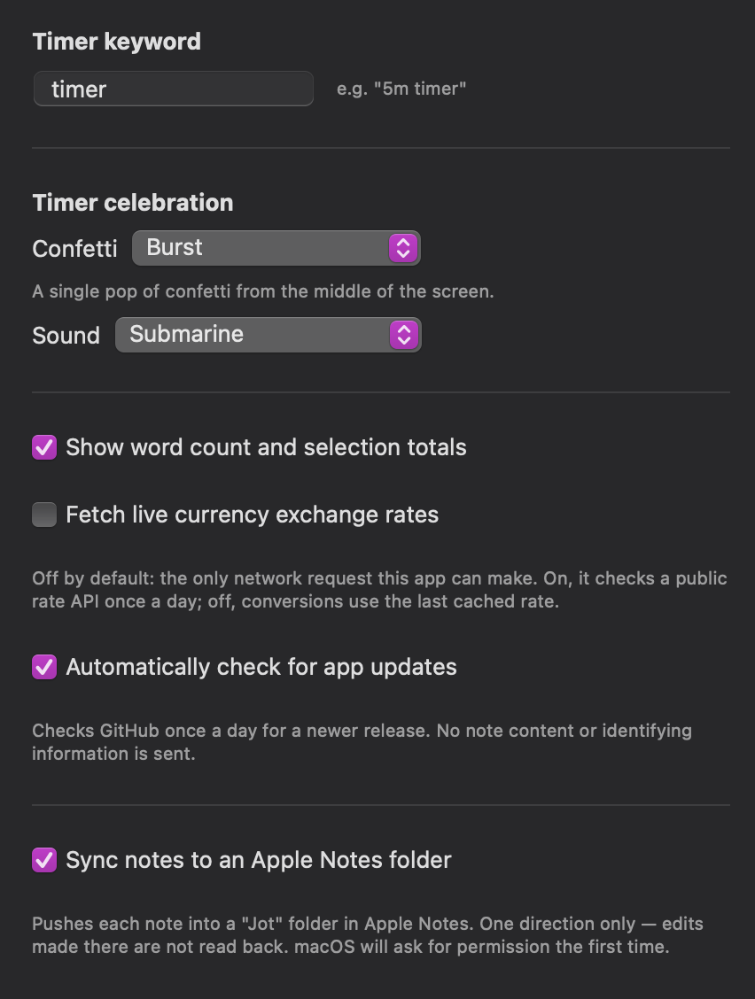

## Building from source

```bash
git clone https://github.com/lsuryatej/jot.git
cd jot
./build.sh && open Jot.app
```

```bash
./test.sh   # logic tests, no Xcode project, no simulator, just swiftc
```

**Xcode is required**, not just the Command Line Tools. The macOS 27 beta CLT
ships a `swiftc` that can't read its own SDK. Xcode bundles a matched
toolchain and SDK pair, so `build.sh` locates one explicitly (checking
`/Applications/Xcode-beta.app`, then `/Applications/Xcode.app`) instead of
trusting `xcode-select`. On a non-beta macOS this constraint likely doesn't
apply at all, a normal Xcode install should just work.

## Layout

| Path | Role |
|---|---|
| `src/main.swift` | AppKit entry point |
| `src/Jot.swift` | App delegate, display modes, panel, status item |
| `src/MainMenu.swift` | Menu bar, including the Find items that drive Cmd+F |
| `src/SettingsManager.swift` | Preferences, display-mode and privacy-toggle definitions |
| `src/PreferencesView.swift` | Settings window and the shortcut recorder |
| `src/HotKeyController.swift` | Global shortcut registration |
| `src/KeyCombo.swift` | Shortcut model and its display form |
| `src/MathExpression.swift` | The math parser and evaluator |
| `src/Units.swift` | Unit conversion tables |
| `src/CurrencyRates.swift` | Opt-in live exchange rates, cached |
| `src/UpdateChecker.swift` | Opt-out GitHub release check |
| `src/TextStatistics.swift` | Word counts and selection sum/average |
| `src/Checklist.swift` | Checklist parsing, rewriting, and list mode |
| `src/CodeBlock.swift` | Code-block keyword matching and the copyable body |
| `src/OrderedList.swift` | Numbered/lettered/roman list parsing and continuation |
| `src/Headings.swift` | Heading line parsing and marker ranges |
| `src/ThemeNote.swift` | Theme-as-note parsing and derived palettes |
| `src/GlassTint.swift` | Tint choices for the translucent papers |
| `src/Celebration.swift` | Timer celebration configuration: styles and sounds |
| `src/CelebrationWindow.swift` | The confetti window itself |
| `src/EdgeTrigger.swift` | Screen-edge trigger strip and hot side |
| `src/EdgeStackView.swift` | The edge sidebar and its note cards |
| `src/Note.swift` | The note model and its stable identity |
| `src/GlobalSearch.swift` | Cross-note search, matching every note's text directly |
| `src/GlobalSearchView.swift` | The Cmd+Shift+F overlay |
| `src/LinkShrink.swift` | Finds long URLs and the domain worth keeping visible |
| `src/Attachments.swift` | Inline image storage and markdown references |
| `src/TextRecognition.swift` | Vision-backed screenshot to text |
| `src/AppleNotesSync.swift` | One-way push into Apple Notes |
| `src/ContentView.swift` | Panel UI: header, editor, timer overlay, share |
| `src/PlainTextEditor.swift` | `NSTextView` wrapper: swipe, images, math rendering |
| `src/NotesManager.swift` | Note state, navigation, timer parsing |
| `src/NoteStore.swift` | Atomic file persistence, backups, and migrations |
| `tests/` | Logic tests, run by `./test.sh` |
| `resources/Info.plist` | Bundle metadata |
| `resources/AppIcon.icns` | App icon, regenerated by `scripts/make-icon.swift` |
| `scripts/release.sh` | Builds and packages a release zip |
| `install.sh` | The curl-installable install path |

`NotesManager`, `NoteStore`, `MathExpression`, `Checklist`, `CodeBlock`, `OrderedList`,
`GlobalSearch`, `LinkShrink`, and `Attachments` are deliberately free of
SwiftUI and AppKit, so every rule in them is covered by a dependency-free
test. The theme parser, glass tints, and celebration configuration touch
only colours and sounds, which behave headless, so they're tested too.
`./test.sh` runs 545 checks total, that plus a UI-layer slice against real
`NSTextView` instances, in a few seconds.

`Jot.app/` and `dist/` are build output and gitignored. `build.sh` deletes
and rebuilds the bundle every run, so a stale binary or signature can't
survive.

## Data

Notes live at `~/Library/Application Support/Jot/notes.json`, written
atomically and debounced, with ten rotating dated backups kept in `Backups/`
alongside it. Images live in `Attachments/`. Settings are in `UserDefaults`
under `com.suryatejlalam.Jot`.

## Not done yet

- No sync across devices.
- Apple Notes sync is one-way, nothing written there is read back.
- The build targets `arm64` only.

## License

[MIT](LICENSE)
