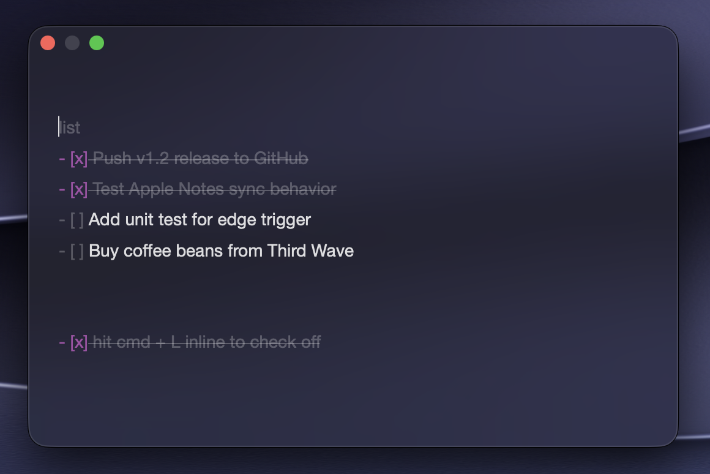
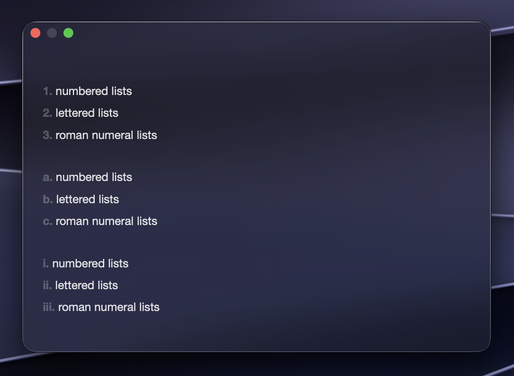
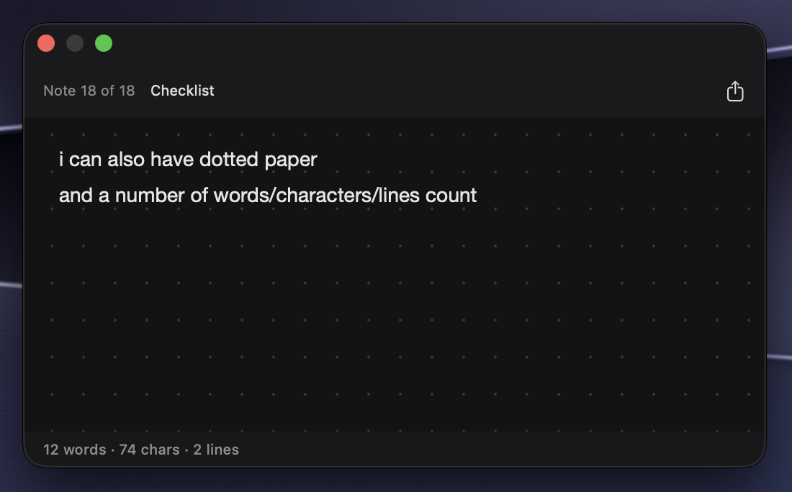
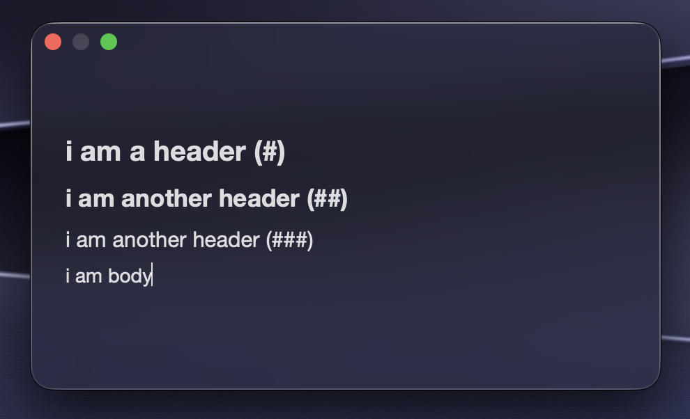
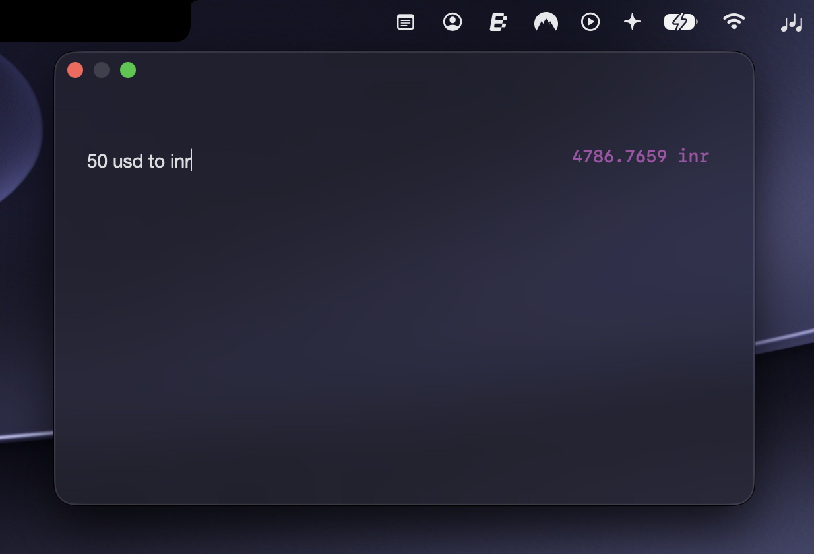
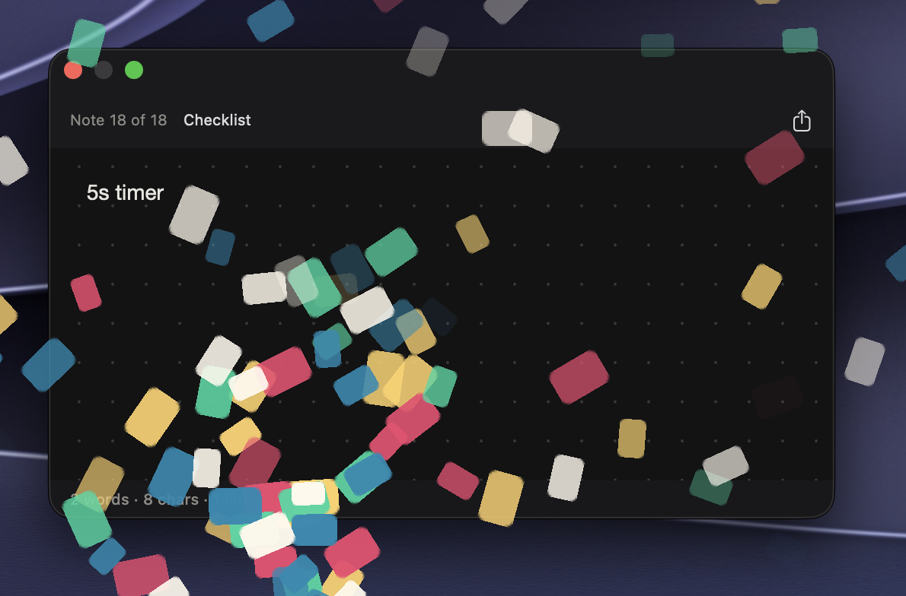
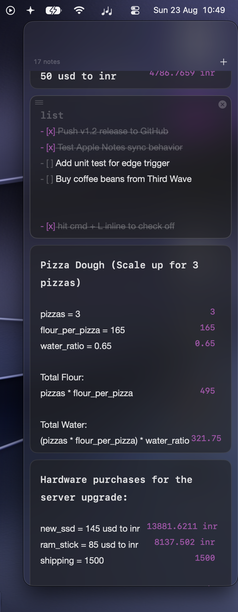
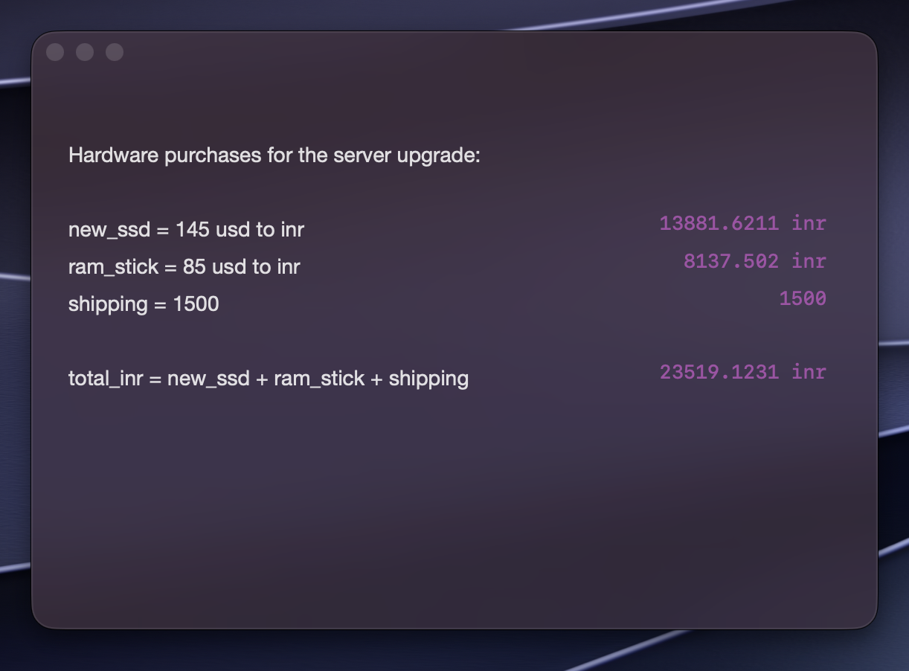
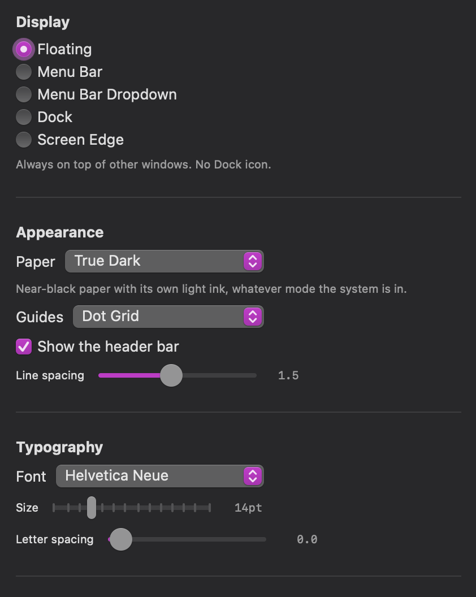
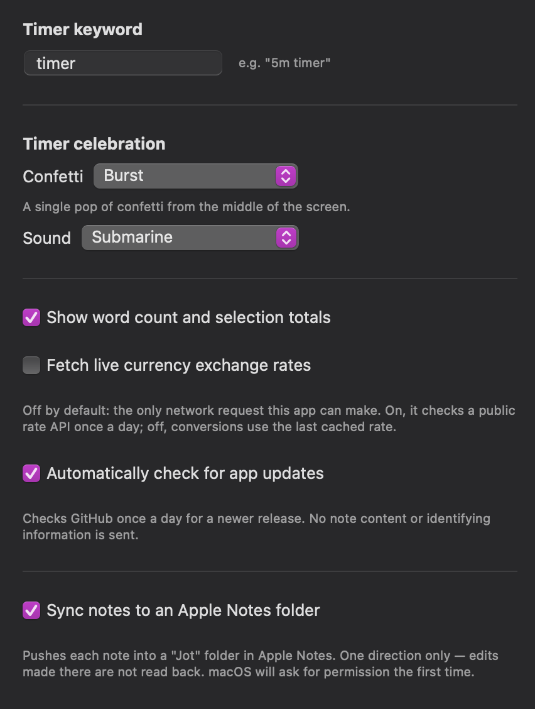

# Jot

A plain-text scratchpad for macOS. No Electron, no dependencies, no telemetry.


Option+A summons a note from anywhere. It floats, docks to the menu bar, sits
in a screen-edge sidebar, or lives in the Dock. Plain text, with checklists,
lists, headings, themes, inline math, unit and currency conversion, timers,
reminders, images, and OCR, built on nothing but Swift, AppKit, and SwiftUI.
No Xcode project, no package manager, no runtime dependency. The whole app is
one `swiftc` invocation compiling straight to a single binary (about a 1 MB
download) with zero non-system libraries linked in.

https://github.com/user-attachments/assets/ee0bb026-4726-4322-8937-3f7a50abe910

<sup>21 seconds: inline math, checklists, the Screen Edge sidebar, and timers.</sup>

## Contents

- [Install](#install)
- [Quick start](#quick-start)
- [Writing](#writing)
- [Formatting](#formatting)
- [Math & units](#math--units)
- [Timers & reminders](#timers--reminders)
- [Images](#images)
- [Notes & navigation](#notes--navigation)
- [Display modes](#display-modes)
- [Appearance](#appearance)
- [Keyboard shortcuts](#keyboard-shortcuts)
- [Accessibility](#accessibility)
- [Privacy & permissions](#privacy--permissions)
- [Updating](#updating)
- [Building from source](#building-from-source)
- [Why this exists](#why-this-exists)

## Install

```bash
brew install lsuryatej/jot/jot
```

Or, without Homebrew:

```bash
curl -fsSL https://raw.githubusercontent.com/lsuryatej/jot/main/install.sh | bash
```

Both install a prebuilt, checksum-verified `Jot.app` to `/Applications` (or
`~/Applications` if that's not writable) and never ask for `sudo`.

Jot is ad-hoc signed, not notarized. There's no paid Apple Developer account
behind this project. Both install paths strip the quarantine flag before you
ever open the app (`install.sh` directly, the Homebrew cask via a
`postflight` step), so neither should trigger a Gatekeeper "Not Opened"
dialog. If you see one anyway, most likely from a copy that predates one of
these fixes, right-click the app → Open, or go to System Settings → Privacy
& Security → **Open Anyway**.

**Removing a Homebrew-installed copy:** use `brew uninstall --cask jot`, not
`rm -rf`. Deleting the app directly leaves Homebrew's own install receipt
pointing at a copy that no longer exists, and the next `brew install` reports
"already installed" and does nothing.

## Quick start

1. Press **Option+A** anywhere. The note appears; press it again to hide it.
2. Type. Everything saves as you go, there is no Save.
3. Try a calculation: `rent = 1240`, then `rent * 12` on the next line. The
   answer appears in the right margin.
4. Type `list` alone on the first line of a new note (**Cmd+N**) and every
   line below becomes a checkbox.
5. Type `5m timer` anywhere and a countdown starts.
6. Move between notes with **Cmd+Option+←/→** or a two-finger swipe.
7. Click the menu bar icon to show or hide Jot; right-click it for Settings,
   updates, and Quit. **Cmd+,** opens Settings while Jot is in front.

## Writing

Everything is plain text on disk. Each feature below reads structure out of
what you typed and styles it on screen, but the file keeps exactly your
characters, so a note is still readable in `cat` and still renders as
markdown in Obsidian, Bear, or GitHub.

**Checklists.** Type `list` alone on the first line and the whole note
becomes a checklist. Every line below it turns into an item, and Return keeps
making more. Pasting multi-line text splits it into items, one per line.
Outside a list note, any `- [ ]` line is a checkbox too, and **Cmd+L** (or the
header's Checklist button) turns the current line or a whole selection into
items, then checks and unchecks them. Click a checkbox to toggle it,
Tab/Shift-Tab nest items, completed items dim and strike through. The file
stays plain markdown (`- [ ]` / `- [x]`), so it renders as a real task list
elsewhere.



**Bulleted lists.** Start a line with `- ` and Return continues the bullet.
Return on an empty bullet ends the list instead of stacking markers. Only `-`
counts: `*` and `+` are already spent on emphasis and math.

**Ordered lists.** Type `1.` or `a.` or `iv.` at the start of a line,
anywhere in any note, and it's a list item. Return continues it, `2.`, then
`3.`, or `b.`, or `iii.`, case preserved, and Return on an empty item ends
the list. Markers render bold beside their text. The file keeps exactly what
you typed; nothing is renumbered behind your back.



**Code notes.** Type `code` alone on the first line and the whole note
renders as monospaced code. Everything this app normally reads out of your
text stays switched off inside it: no checklists, no headings, no
highlights, no shrunk links, no math results, no timers or reminders. `==` is
an operator again, `# ` is a comment, and Tab inserts a tab. **Cmd+C** with
nothing selected copies the whole block, keyword line excluded, so you can
put the caret anywhere in it and paste the code straight out.

**Keywords.** `list`, `code`, `timer`, `pomodoro`, and `remind` are all
configurable in Settings → Notes & Timers. `list` and `code` only count when
they are the whole first line, so "listen to the podcast" stays an ordinary
note.

**Screenshot to text.** **Shift+Cmd+V** reads the image on your clipboard
with Apple's Vision framework and inserts the text it finds. Fully offline,
no cloud OCR service involved.

**Counts and totals.** A footer shows live word, character, and line counts,
and selecting text with two or more numbers in it shows their sum and
average. Select `rent $1,240.50 and food $310.25` and see the total without
leaving the note.



## Formatting

Markers stay in the file and fold out of view on screen, leaving just the
styled text behind.

**Headings.** Start a line with `#` through `######` and a space, and it
renders as a heading, sized by its level. The hashes fold out of view. When
the first line is a heading, its text becomes the note's title. `#hashtag`
with no space stays ordinary text.



**Bold, italic, and inline code.** `**bold**`, `*italic*` and `` `code` ``
render with their markers folded away. **Cmd+B** and **Cmd+I** write the
markers for you: with a selection they wrap it, and pressed on text that is
already bold (or italic) they take the markers back off. With no selection, a
caret inside a word wraps that word; anywhere else they drop an empty pair
with the caret between. Each press is one Cmd+Z. Underscore emphasis
(`_like this_`) is deliberately left literal, so `some_var_name` never turns
italic halfway through.

**Highlights.** Select text and press **Shift+Cmd+H** (or the header's
Highlight button) to wrap it in `==like this==`, Obsidian's own highlighter
syntax, so it still renders as a real highlight wherever else the note ends
up. Press it again on highlighted text to strip the markers back off. With
nothing selected it drops an empty pair and puts the caret between them.

**Links.** A long URL collapses to just its domain, `example.com` instead of
the full `https://www.example.com/some/very/long/path?query=1`.
**Cmd+click** a link to open it in your browser (or mail client, for an email
address); only http, https and mailto links open. A plain click on a shortened
link expands it back to the full URL for editing, and it folds again once the
caret leaves it. The file always has the whole URL.

## Math & units

```
budget = 5000
budget * 1.2          → 6000
10 + 20%               → 12
20% of 50              → 10
5 km to miles          → 3.1069 mi
50 usd to inr           → 4385.96 inr
```

A recursive-descent parser evaluates the whole note top to bottom on every
keystroke. Results are drawn in the right margin and never touch the text.

- **Operators:** `+ - * / ^` and parentheses, plus the words `plus` and
  `minus`. Numbers can carry thousands separators (`1,240.50`).
- **Variables:** `name = value` on one line is visible to every line below
  it. A variable alone on a line shows its value.
- **Percentages:** `20% of 50`, `50 + 20%`, `50 - 20%`, `20% on 50`,
  `20% off 50`.
- **Prose stays prose.** A line with no operator is left alone, even if it
  starts with a number, so "5 apples" never turns into a calculation.
- **Units** convert with `to`, `in`, or `as`, offline, from a fixed table:
  length (mm, cm, m, km, in, ft, yd, mi), mass (mg, g, kg, oz, lb), time (s,
  min, h, day, week), data (B, KB, MB, GB), and temperature (C, F, K). Spelled
  out names work too (`kilometers`, `pounds`). Adding mixed units keeps the
  left one: `5 km + 3 m` is 5.003 km.
- **Currency:** three-letter codes (`50 usd to eur`), and `$50` reads as US
  dollars. Live rates are off by default (see
  [Privacy](#privacy--permissions)); with them off, an explicit `to`
  conversion uses the last cached rate or a built-in snapshot. A sum that
  mixes currencies without live rates shows "rates off" in the margin
  instead of a number; click it to jump to the setting.



## Timers & reminders

**Timers.** `5m timer`, `30s timer`, `2h timer`. A countdown chip appears in
the corner. A timer belongs to the note that started it, keeps running while
you move to other notes (the chip then names the note it belongs to), and
won't restart itself after firing. One timer runs at a time; starting
another takes over.

**Pomodoro.** `pomodoro 25/5` starts a work/break cycle: work minutes, then
break minutes. The chip says which half you're in ("Work" or "Break"), and
each phase fires the celebration before starting the next one automatically.
It keeps alternating for as long as the line stays in the note.

**Celebrations.** When a timer or Pomodoro phase ends you get a sound and,
if you want it, confetti: Cannons from the bottom corners, Rain from above,
or a single Burst, or Sound only. Eight system sounds to pick from. The
celebration never takes focus from what you're typing.



**Reminders.** `remind 3pm`, `remind tomorrow 9am`, `remind fri at 10:30`,
`remind next monday noon`, or `remind in 20 minutes`. A reminder fires a real
macOS notification at that clock time, whether or not Jot is in front. Times
can be `3pm`, `3:30pm`, `15:30`, `noon`, or `midnight`; a bare `9` with no
am/pm is ignored rather than guessed at. A time that has already passed today
rolls to tomorrow. A toast confirms what was understood ("Reminder set for
Tomorrow at 9:00 AM"), so a typo shows up right away. Any number of reminders
can be pending, and deleting the line cancels its reminder. The first
reminder asks for notification permission.

## Images

Paste or drop an image and it stays an image, drawn inline in the note. The
picture is saved as a PNG in `Attachments/` beside your notes, and the text
keeps a markdown image reference pointing at that file, the same syntax
Obsidian uses, so a note with a picture in it is still something you can
read in `cat`. **Cmd+V** keeps a pasted image as an image; **Shift+Cmd+V**
reads the text out of it instead.

## Notes & navigation

**Global hotkey.** Option+A toggles the note from anywhere, rebindable in
Settings → General (or Shortcuts). Registered through Carbon's
`RegisterEventHotKey`, which needs no Accessibility permission and consumes
the keystroke, so it won't also type `å` into whatever app is in front.

**Many notes.** **Cmd+N** starts a new note. **Cmd+Option+→** and
**Cmd+Option+←** move to the next or previous note, the keyboard equivalent of
a two-finger swipe; moving past the last note starts a new one. With the
header hidden, a brief badge names the note you landed on. Blank notes are
tidied away as you move between notes.

**Reorder.** **Ctrl+Cmd+↑** and **Ctrl+Cmd+↓** walk the open note up or down
the list one slot at a time. In the Screen Edge sidebar, hover a card and
drag it by the grip in its corner; the stack parts around the drag and the
order you leave it in is the saved order.

**Find.** **Cmd+F** opens the real macOS find bar with match highlighting,
with **Cmd+G** / **Shift+Cmd+G** for next and previous and **Cmd+E** to use
the selection.

**Search every note.** **Shift+Cmd+F** searches all your notes at once and
jumps straight to the matching line. Esc closes it.

**Share.** The share button in the header sends the note's text to any macOS
share target: Mail, Messages, AirDrop, Notes, and so on.

**Apple Notes sync.** Off by default. Turn it on in Settings → Privacy & Sync
and each note is pushed into a "Jot" folder in Apple Notes, one direction
only, with its images coming along. Nothing written there is ever read back,
and deleting a note in Jot never deletes it in Notes. In Dock mode the Jot
menu also has **Sync to Apple Notes** for an immediate push.

**Where notes live.** `~/Library/Application Support/Jot/notes.json`, written
atomically and debounced, with ten rotating dated backups kept in `Backups/`
alongside it. Images live in `Attachments/`. Settings are in `UserDefaults`
under `com.suryatejlalam.Jot`.

## Display modes

Five modes, switchable live in Settings → General:

| Mode | Behaviour |
|---|---|
| Floating | Always on top, no Dock icon, never steals focus. |
| Menu Bar | Ordinary window level, toggled from the menu bar icon. |
| Menu Bar Dropdown | Drops down under the icon, hides when you click away. |
| Dock | Dock icon and app switcher entry, like a normal app. |
| Screen Edge | A sidebar docked to the left or right screen edge, holding every note as its own card. |

**Screen Edge** reveals itself when you rest the cursor against that edge or
click the bar that sits there, and slides away when the pointer leaves. A
hover reveal never takes the keyboard from the app you're in; click into a
card to type. Each card has its own delete button, a grip to reorder it, and
a handle to resize it (double-click the handle to fit the card to its
content); a button at the top adds a note. The sidebar's width and side are in
Settings.



## Appearance

**Papers.** Six surfaces: Frosted, Glass, Solid, True Dark, Cream, and
White. The translucent ones follow the system's light or dark mode and take
an optional colour tint (graphite, amber, rose, moss, indigo), previewed on
their picker entries. The opaque papers bring their own ink colours rather
than following the system mode, so True Dark stays dark in daylight and White
stays white at night. Text, secondary labels, and accent-coloured marks are
held to readable contrast on every paper.



**Guides.** Optional writing guides under the text, dot grid or square
grid, drawn to follow your font and line spacing.

**Header and footer.** The header shows "Note N of M", the Checklist and
Highlight buttons, this note's font and size, and Share. The footer shows the
counts. Hide either in Settings, or both at once with **Cmd+/**, down to
nothing but text on paper.

**Typography, per note.** Eight curated system fonts (SF Mono, SF Pro, New
York, SF Rounded, Menlo, Monaco, American Typewriter, Helvetica Neue) plus a
size, set independently for whichever note you have open, so switching one
note to a serif for reading doesn't drag every other note along with it.
Reachable from the header's font menu and size stepper, or Settings →
Typography, which also holds a separate "Default for new notes" pair. Letter
spacing and line spacing are app-wide. Curated rather than the system Font
Panel on purpose: every feature here repaints font attributes across the
whole note on every keystroke, so a per-character pick from Font Book would
look like it worked and then vanish on the next edit.

**Theme notes.** Type `theme` alone on a note's first line and that note
becomes a theme for the whole app, live as you type:

```
theme
paper: #223038
ink: #e8e4d8
size: 14
guides: dots
```

One `key: value` pair per line: `paper` (a hex; the chrome, cards and ink
derive from it), `tint` (a named wash for the translucent papers instead),
`ink`, `font`, `size`, `spacing` (line height), `tracking` (letter spacing),
and `guides` (`dots`, `grid`, or `none`). Anything unrecognised is ignored
rather than rejected, so prose can sit among the settings as commentary. The
theme exists only while its note does: edit it like any other text, delete
it and the app falls back to your Settings. When several notes are themes,
the bottom-most one wins. Nothing separate is saved anywhere.



*(Screenshot predates the Settings redesign: Settings now splits into
General, Appearance, Typography, Notes & Timers, Shortcuts, and Privacy &
Sync panes rather than one long scroll.)*

## Keyboard shortcuts

Settings → Shortcuts lists these too.

| Shortcut | Action |
|---|---|
| **Option+A** (configurable) | Show or hide Jot from anywhere on macOS |
| **Cmd+N** | New note |
| **Cmd+Option+→** / **Cmd+Option+←** | Next / previous note |
| **Ctrl+Cmd+↑** / **Ctrl+Cmd+↓** | Move the current note up / down the list |
| **Cmd+W** | Close the frontmost window: hides the note, or closes Settings |
| **Cmd+L** | Toggle the checkbox on the current line, or every line selected |
| **Tab** / **Shift+Tab** | Nest / un-nest a checklist item |
| **Cmd+B** / **Cmd+I** | Bold / italicise the selection or the word at the caret, again to remove |
| **Shift+Cmd+H** | Highlight the selection, or start one at the caret, again to remove |
| **Shift+Cmd+V** | Read the clipboard image as text (OCR) instead of pasting it |
| **Cmd+C** (nothing selected, in a `code` note) | Copy the whole code block |
| **Cmd+F** | Find in the current note |
| **Cmd+G** / **Shift+Cmd+G** | Find next / previous |
| **Cmd+E** | Use the selection for find |
| **Shift+Cmd+F** | Search every note |
| **Cmd+/** | Toggle the header and footer together |
| **Cmd+,** | Settings |
| **Cmd+H** | Hide Jot |
| **Cmd+Q** | Quit |
| Cmd+click a link | Open it (http, https and mailto only) |
| Click a shortened link | Expand it to the full URL for editing |
| Two-finger swipe | Next / previous note (single-note display modes) |

Cut, Copy, Paste, Select All, Undo and Redo are the standard
Cmd+X/C/V/A/Z/Shift+Cmd+Z you'd expect anywhere on macOS.

## Accessibility

**VoiceOver.**

- Math results, which are only drawn in the margin, are spoken. When the
  result on the caret's line changes and your typing pauses, VoiceOver
  announces it ("equals 48"). Only the caret's line, so editing a variable
  doesn't read out every line below it.
- A **Results** rotor (VO-U, then arrow to Results) steps through every line
  with a result, reading "line 4 equals 48" and moving the VoiceOver cursor
  there. Type in the rotor to filter by value.
- An image in a note reads as the single word "Image", not its file path.
- Icon buttons are labelled: Share note, New note, Delete note, Reorder note,
  Resize note, Close search. Screen Edge cards read as "Note 2 of 5" and
  offer a Delete note action; the timer chip reads as one sentence ("Pomodoro
  work, 12:34 remaining"); search results read their note and snippet.

**Reduce Motion.** The Screen Edge sidebar fades in place instead of
sliding; the swipe badge and reminder toast fade instead of dropping in;
reorders and jumps to a search match happen without animating, and a dragged
card no longer shrinks. Timer confetti still plays, since it is something you
picked; choose **Sound only** in Settings → Notes & Timers to turn it off.

**Increase Contrast.** Hairlines around the window and cards strengthen, the
decorative lit edge and tint wash step aside, and secondary text and the
accent colour used for math results and checked items darken (or lighten, on
dark papers) further. The accent keeps your system accent's hue on Frosted,
Glass, Solid, White and Cream, adjusted to at least 4.5:1 against the paper
normally and 7:1 under Increase Contrast.

## Privacy & permissions

By default, Jot's only network request is **one anonymous update check a
day**. The only two things that can ever leave your machine, both toggleable
in Settings → Privacy & Sync:

- **Live currency rates**, off by default. On, it's one request a day to a
  public, key-free exchange-rate API. Nothing about you or your notes is in
  the request.
- **Update checks**, on by default. A stale copy silently missing bug fixes
  is a worse outcome than one anonymous GET a day to GitHub's public releases
  API. Turn it off in Settings if you'd rather not.

Nothing else. No analytics, no crash reporting, no identifiers.

Permissions macOS may ask for, each only when you use the feature:

- **Notifications**, the first time you type a `remind` line.
- **Automation (Notes)**, the first time Apple Notes sync runs. It talks to
  Notes.app locally via AppleScript and never touches the network.

The global hotkey needs no Accessibility permission, and OCR runs on device.



## Updating

With update checks on, Jot looks at GitHub once a day. When a newer release
exists, the menu bar icon's right-click menu shows **Update Available**;
otherwise it offers **Check for Updates…** to look right now.

- **Installed with Homebrew:** choosing the update runs `brew upgrade` for
  you and relaunches into the new version. `brew upgrade jot` from a terminal
  works too.
- **Installed with `install.sh`:** Jot won't replace itself; it offers to
  open the GitHub releases page so you can download the new version. Running
  the install command again also updates in place.

## Building from source

```bash
git clone https://github.com/lsuryatej/jot.git
cd jot
./build.sh && open Jot.app
```

```bash
./test.sh      # logic tests, no Xcode project, no simulator, just swiftc
./test-ui.sh   # opt-in: real windows, real clicks, real SwiftUI
```

`./test.sh` is the one you run constantly. It compiles the logic layer and
finishes in seconds. `./test-ui.sh` is separate because it brings up a real
`NSApplication` and real windows, sends real mouse events through AppKit
hit-testing into real SwiftUI buttons, and reads the result back out of the
rendered pixels. That catches the layout and live-interaction bugs the fast
suite structurally cannot see, and it costs seconds per run, so it stays out
of the default suite. Still swiftc only, still no dependencies.

**Xcode is required**, not just the Command Line Tools. The macOS 27 beta CLT
ships a `swiftc` that can't read its own SDK. Xcode bundles a matched
toolchain and SDK pair, so `build.sh` locates one explicitly (checking
`/Applications/Xcode-beta.app`, then `/Applications/Xcode.app`) instead of
trusting `xcode-select`. On a non-beta macOS this constraint likely doesn't
apply at all, a normal Xcode install should just work.

### Continuous verification

Both install paths above are checked by CI, not just by hand. Every release
in [`release.yml`](.github/workflows/release.yml):

- refuses to build if the tag and `Info.plist` versions disagree,
- **`bump-homebrew-cask`** points the
  [Homebrew tap](https://github.com/lsuryatej/homebrew-jot) at the new
  version and checksum, so the in-app updater's `brew upgrade` can see it,
  and the GitHub release itself stays unpublished until this succeeds, so a
  failed tap bump can't leave a public release the updater can't install,
- **`smoke-test-install-sh`** and **`smoke-test-brew`** each install the
  published release on a fresh runner, the way a user would, and check the
  version, the ad-hoc signature, and that the app is not quarantined.

[`brew-smoke-test.yml`](.github/workflows/brew-smoke-test.yml) repeats the
Homebrew check daily and fails if the cask installs anything older than the
latest release.

Both ran through a genuinely fresh machine before the quarantine fix was
trusted, not just the machine it was written on.

File-by-file layout, what's tested where, and build-output details live in
[ARCHITECTURE.md](ARCHITECTURE.md).

## Why this exists

Most "quick note" apps on macOS are either a $5-59 indie tool (Antinote,
Numi, Soulver) or a full Electron shell burning 150MB+ before you've typed a
word. Jot does the scratchpad basics, math that works, images you can drop
in, quick recall, in a download of about 1 MB.

### How it compares

Prices and feature lists as of August 2026, pulled from each app's own site
and App Store listing. All three are solid, well-made tools, this is just
what you get for free with Jot versus what they charge for.

| | **Jot** | [Antinote](https://antinote.io/) | [Numi](https://numi.app/) | [Soulver 4](https://soulver.app/) |
|---|---|---|---|---|
| Price | Free, open source | $5 one-time | Free, $23.59 to unlock notes + sync | $59 one-time (+$26/yr optional) |
| Size | ~1 MB download, zero dependencies | Lightweight, closed | Lightweight, closed | Lightweight, closed |
| Inline math with variables | Yes | Yes | Yes | Yes |
| Unit conversion | Yes, offline | Yes | Yes | Yes |
| Currency conversion | Yes, opt-in live rates | Yes | Yes, paid tier | Yes, live by default |
| Checklists | Yes | Yes | No | No |
| Images pasted inline | Yes | No | No | No |
| Screenshot to text (OCR) | Yes, offline | Yes | No | No |
| Display modes | 5: floating, dock, menu bar, dropdown, screen edge | Menu bar only | Window | Window |
| Search across all notes | Yes | Yes | N/A | Yes |
| Long links collapse to their domain | Yes | Yes | N/A | N/A |
| Sync across devices | No | iCloud (2.0+), iOS app in progress | iCloud, paid tier | iCloud, iOS/iPad apps |
| Scripting / themes | Themes (notes); no scripting | Yes, JS extensions + themes | No | CLI, URL schemes, Automator |
| Apple Notes sync | Yes, opt-in, one-way | No | No | No |
| Network requests | One daily update check (can be turned off); live rates opt-in | iCloud only, if enabled | iCloud only, if paid | Live data on by default |
| Source | Open, MIT | Closed | Core open, paid features closed | Closed |

Jot doesn't beat any of these on every axis. Against Antinote specifically:
no sync across devices, no scripting, no AutoPaste. Antinote is also a
mature, several-year-old product; Jot is new. What Jot gives you instead is
free and open source, inline images, five display modes instead of
menu-bar-only, search across every note, link shrink, and an explicit
zero-telemetry stance: one anonymous update check a day that you can turn
off, live rates opt-in, nothing bundled into iCloud.

### Not done yet

- No sync across devices.
- Apple Notes sync is one-way, nothing written there is read back.
- The build targets `arm64` only.

## License

[MIT](LICENSE)
